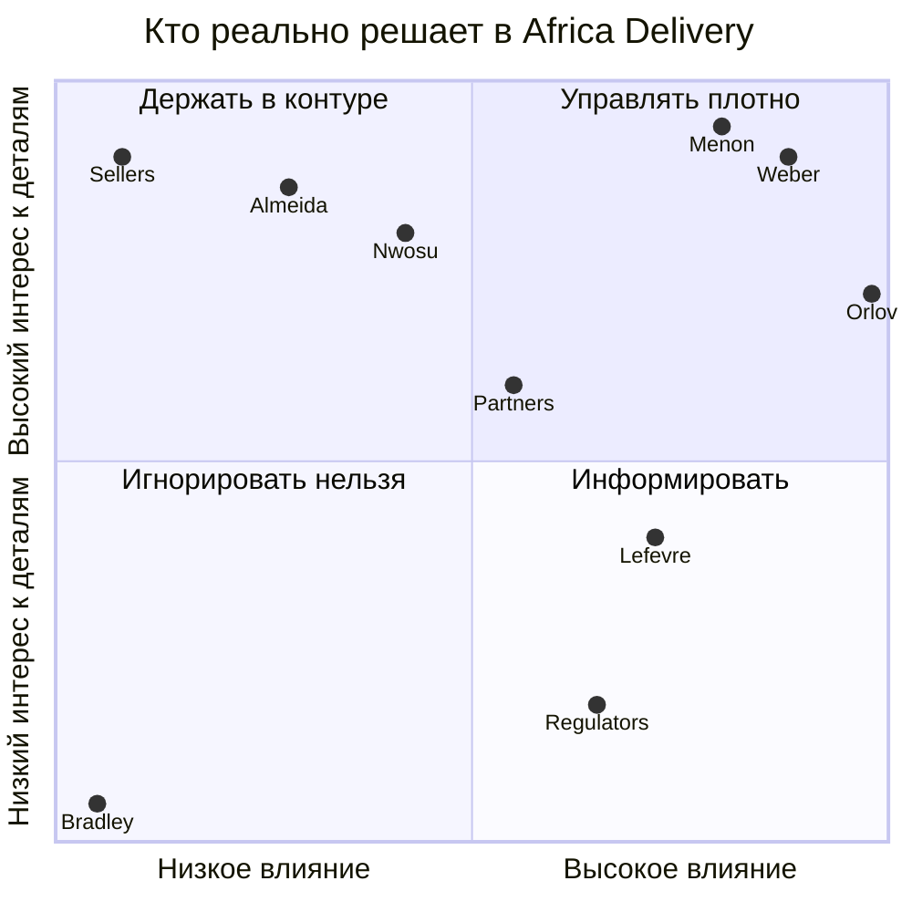

# Stakeholder Matrix — Africa Delivery

*Task 1 · Solution Architect · v1.0 · подготовлено до встречи в Найроби*

**Как читать.** Тип власти важнее уровня влияния: вето кошелька сильнее громких требований.
**Приоритет при конфликте** = чей голос побеждает в споре, а не кто важнее как человек.
**Единица оценки влияния** — способность остановить запуск 15 октября, а не должность.

| # | Кто | Что на самом деле защищает | Тип власти | Влияние (1–5) | Приоритет при конфликте | Как с ним говорить | Что даст его «да» |
|---|---|---|---|---|---|---|---|
| 1 | **К. Орлов, инвестор, единственный акционер** | Дату запуска и свою репутацию перед государем («министр!!»); narrative «Amazon только в Африке» | Абсолютная по целям и срокам, **нулевая по расходам** (счета >$500 подписывает не он) | 5 | **1** | Одна страница, письменный ответ, никаких «это проблема» — только «решение и цена» (его собственные слова). До его отлёта в четверг | Подпись под списком из 8 позиций релиза и под выбором между доступностью и бюджетом |
| 2 | **Анна Вебер, CFO** | Выжить до 15-го месяца (runway 9 мес.), юнит-экономику (платежи <2,5% GMV) | **Де-факто со-владелец**: вето на каждый счёт >$500/мес, запрет предоплат и лицензий за ядро | 5 | **2** | Цифры и только цифры: unit cost заказа, TCO-5 лет, цена ошибки в обе стороны. Её письмо — единственный фальсифицируемый документ в наборе | Письменное согласование позиции >$500/мес и ясность, кто платит за стрим и SMS |
| 3 | **Раджеш Менон, CTO (мой прямой руководитель)** | Техническое наследие, свой стек, страх «того CTO, у которого всё легло»; KubeCon-опыт как источник истины | Монополия на технологию по прямому делегированию инвестора («технологии — твоя зона») **и** право решать за меня | 4 | **3** | ADR-черновик лично до Найроби (он сам это просил), аргумент через его метрики — эксплуатационные часы, а не через «так не делают» | Совместно подписанный ADR, в котором он сохраняет авторство технологии, но меняет её масштаб |
| 4 | **Марк Лефевр, CEO (6 недель, из Jumia)** | Свою первую поставленную обещание; разделение релизов он запросил сам | Формально максимальная, по факту — передаточная: его власть реальна ровно там, где инвестор не лезет | 4 | **4** | Язык скоупа и последствий для выручки, глаголы, а не архитектура. Один на один, до общей встречи | Он объявляет себя владельцем скоупа релиза и снимает невыполнимые рекламные обещания |
| 5 | **Адаезе Нвосу, внешний юрист (Лагос, почасово)** | Репутацию перед регулятором и отсутствие ответственности («письмо предварительное») | **Отложенное вето**: рекомендация не финализовать архитектуру + 4–6 недель ожидания | 2 формально / 4 по календарю | Стоп-фактор, а не сторона спора | Узкое ТЗ на 3 страницы: не «заключение», а два конкретных технических конфига на проверку | Письменное «допустимо/недопустимо» по токен-границе PII и по базе SMS-номеров |
| 6 | **София Алмейда, маркетинг** | Оплаченную кампанию и выполнимость своих креативов | Влияние через **fait accompli**: оплаченное обещание становится моим требованием без её ответственности за сроки | 2 | 5 | Только через CEO и только списком «вот что физически нельзя, вот вариант-замена» | Признание, что часть обещаний (5 языков, «премиум-зум») не входит в день запуска |
| 7 | **Том Брэдли, бывший PM (уволен 04.08)** | Уже ничего | Нулевая. Его 29 функций — **артефакт без владельца**, единственный «бэклог» проекта | 0 | — | Не с кем. Это не стейкхолдер, это симптом | — |
| 8 | **Партнёры: Flutterwave / M-Pesa / Paystack, Sendbox, Sendy, SMS-агрегатор, live-vendor** | Свои KYC-процедуры, сроки settlement, комиссии | **Внешнее блокирующее влияние**: их KYC и договор стоят на критическом пути, но в переговорах их нет ни на одной минуте | 4 по календарю / 0 в политике | Выше всех на критическом пути, ниже всех в переговорах | Через инвестора и CEO, статус-трекер по датам, не через архитектуру | Production-ключи и договор с лицензированным провайдером до 25 сентября |
| 9 | **Регуляторы (NDPC Нигерия, InfoReg ЮАР, ODPC Кения)** | Соблюдение NDPR / POPIA / KICA + DPA 2019 | Власть 5 по последствиям, интерес 1 до первой жалобы. Вход — через связи инвестора, которых у меня нет | 5 по последствию / 1 по вовлечённости | Вне таблицы приоритетов: не участвует в споре, участвует в санкциях | Не с ними напрямую — через юриста и ранний контакт, который он сам рекомендовал | Ранний контакт до запуска, а не после рекламы по 410k номеров |
| 10 | **Продавцы (малый/средний бизнес, часть без интернета) и покупатели** | Деньги на счёт сегодня; товар без подделок | Нулевая сейчас, максимальная через 6 месяцев. Их голос **исключён из процесса приказом**: «зачем тебе говорить с продавцами» | 0 сейчас / 5 потом | — | Через 10–15 полевых интервью в Лагосе, которые я просил и которые были отклонены | Пять интервью, сделанных до проектирования кабинета продавца |

## Влияние / интерес

## Где на самом деле лежат права на решение

| Решение, которое нужно принять сейчас | Формально владелец | Фактически решает | Чем это опасно |
|---|---|---|---|
| Дата запуска 15 октября | CEO | Инвестор | Не предмет торга. С ней нужно примириться в первом же абзаце любого документа |
| Регулярные расходы (вычисления, БД, SaaS, лицензии) | CFO с $500/мес | CFO | «Правильное» техническое решение без её подписи юридически не существует |
| СУБД, язык, форма системы | CTO | CTO, но упирается в бюджет и найм | Мой конфликт с руководителем: публично проигрывать его в Найроби нельзя |
| Скоуп первого релиза | **Никто** (PM уволен) | Вакансия; инвестор дал размытое «всё, к чему прикасается покупатель» | Главная управленческая дыра: требования без владельца = 29 функций P0 |
| Допустимая доступность | Инвестор | Инвестор, но платит CFO | Он сам себе противоречит: два своих же требования несовместимы |
| Размещение ПДн | Юрист (заключение через 4–6 недель) | Инвестор по политическому риску | Решение нужно раньше заключения, поэтому только обратимое |
| Рекламные обещания | Маркетинг | Никто не уполномочен снять | Оплаченное ≠ обязательное, но де-факто стало требованием |
| KYC и доступы платёжных провайдеров | **Никто** | Внешние партнёры | Критический путь запуска без владельца в компании |

## Выводы, которые важнее самой таблицы

1. **Решающий голос — инвестор, но только по целям.** Он нанял CEO/CTO/CFO и оставил себе дату, политический риск и narrative. Он не подписывает счета и не нанимает — то есть по средствам он бессилен, хотя об этом не сказано ни в одном артефакте.
2. **Формально инвестор — «полный карт-бланш», фактически он раздал несовместимые пары полномочий разным людям** (сроки — себе, деньги — CFO, технологии — CTO, скоуп — никому). Ни один человек в компании не отвечает одновременно за скоуп и за бюджет. Это и есть моя рабочая должность: не архитектура, а контракт между бюджетом и технологией.
3. **CFO — второй голос по силе, хотя в транскрипте её нет ни разу.** У неё единственный документ с числами, датами и правом вето. Всё, что я нарисую, проходит через её подпись; значит она участник архитектурного процесса, а не бухгалтер на периферии.
4. **CTO — мой руководитель, а не оппонент.** Любое расхождение с ним должно быть закрыто один на один до Найроби (он прямо просил «зайти туда согласованными»). Публичная победа над ним в его же зоне стоит дороже, чем компромисс в архитектуре.
5. **Слабое звено не власть, а календарь.** Партнёры и юрист имеют низкое политическое влияние и при этом держат критический путь. Карта влияния, где их нет, врёт — поэтому они в матрице.
6. **Отсутствующий стейкхолдер — сам рынок.** В компании нет ни одного человека с локального рынка, а разговор с продавцами запрещён инвестором. Значит решения о кабинете продавца, USSD-сценариях и адресации принимаются без источника данных, и это надо зафиксировать как риск, а не как допущение.

Сервер PlantUML
Разместите меня на GitHub
Создайте свой PlantUML диаграммы прямо в вашем браузере!

https://plantuml.planeta-team.ru/png/bLVRJbjN47ttLup8GnF94DiOugHf98EFepG4WycbQUc3YGrn0iULCGrjLScOa3I2GAujAW5oaVhII74CJenj78alsESN-YLTC_lumh6f6al8nsVlFRDcrfgPpUpjfFb3B1sReOdOZTjJwTIS6HzCJQVIT2mi7zTiOyVipLWyTITfJj5aR7esqR9Y7qkRYJHvVIqBySHaR6uw4qwPcR7apuaZ5uTZCmdg2YLknQxEqLZCdErgsHTCfrDtR511Oo0mw6zrdRYHYPbJqmdwnKKqS4GGM4cbuudqOIj4xDj-v_Lx0zwm_Qu3dbzRd9gfpD7-Gc6FqryeC1WE1c32bKbc05NzQULKZQoiAggygbWhQj_-QVs65qKhHwf0mSbqyaQCGedfv8-9z4_ZfdgYAgfahM5tIHK9N_dweIA_izQ8vedKkjg7_Q8iBP0gazfbc-9gJLLThcRIkaPzTF2Hr3FrNBrKlwj7whLwI-e98AejjObVR_3-ENmNdBvBwgCggvegkWdFXpmMh6Lh0KjbBEnrKMoMuEQO4GXxmeRahGK0d1HKpLgm5WL80POv8BQ_HzOgJ9Qmc8EJ3GImmrl7JK-FtqSdoTCJy01Q5Qu-wAon8GuK-OIfafMpLiYwo_WuUi6Sj-vXOPNmaBMMU0-oLyREHVnU5hJ3ro9ZLnmm7-5u5JltaCoyGAso1SJ8gMK7EupB5z2u-e6hfZxXKDwwB_JiMykSk9fwZnCF12Cp1gBXNPGWTWhuNX8KmQ5BneLGq85Z6tjhZ05PlcSjCnAlnwF507ybUAnnI0p6ey6SvYJjIsxM94cj40IJK6QZpV6R0h52UVC7_hdB4LWh0clC61eoecEivbOTUIKdRzGszF88IjrGxxIMjl6uXSTDjTKkewPI_g-Gl2YoGIDWzBS9QGkdAiox86562cn50id2TX5Xi7r-KsXGiWSXW01e0aTPUrdEt6cTkLE-SHDBHGRjvZHmUlBaxUlnUjoSxfg40zwOP40jQzcAQ7NXvRKVczD8T2XorO7x2Ump8Ld6FHYEiFz02tC5KLXDt17GtxSUirf9-Ea3zrV6GYAZgeIxPjrpYnmWrIgnuBb0H3KVE6h1SSqOCA8E72ya9qY2uBYiSNWq3Z_omBmioGxEyevMxoS1XifPapAiCgvTILXHjcIb4BNOLzjOKNb1SyaOZWmxTQx5Q3q6QhjqIjJmlE38UP6HS47diFan5pAZx-iJzFsSnPArH1Ul3xALsPWPdqZDqrTDHgK0xVuWa4Q2qSl37MJUA-9QLqzPpv3wElwsGA7TE3VHHpVKM_M7UlUPFRE-s11wBuJk3VU6_Mr2v_WU0ZgCCneybws5xf5BRh8MkPbAylV9uqS3a3QWq-3f6pTzfz4EiMlVblmUZNYQNRCYcLrnao3FQoAj5UpCazH6Jg0DH8EX8UEwCpN-8oQ9xWURagRdwXLIjlxPZS0vmphaouy9qn_s6y6sV6tWv5s4Kh1Bp8YuAJ7V_VNSJ3B6-JcbPuaVCh4UYg3o8ZwU4sjVIYUK8LrchNDzO0-xhzgp-k3lUeEKChIV3ogiEbwiIbUkw0wZkqOP77pIpLROsZkeI1H3HjYu6ZKS0RpaOiA92lTlhXlTzuT38uDqVFZy2JU5HY9q_AA1fmlcPAg7eecf7Zh-RV04nzUl-VT2349qaTF9zS2SEb8DBqMPjliIR8TnAdKEDBOOeiRvAqF1on5TAbzGDpx4APJPc0Tvo1Op1wh8D--J3QxhmMykZ57tTpUJyNZ2_1xtIhFx7E6QuC9D0P_6IZevTJE3fL6lSwLnfjU5eT1nnUz25NMqrhPIFmDrlePIdxgWf_zSTyabS2ALoQHcA3NPN20wEt4Eb25qRemoTZJ9MkhrQnxkDW-aIIBFExgfuaJ-xCc9Sx2X_d9E7NVdiN96t3Lc7nztozq46-IapJ9pbhKRiLn8sCapBLLkgRgzMgiy9BNDnbooRIACRjGHJqiPHysvnC18lPV3SX63Gmoc3fE9dRvkdoFQOMC0DHrscYEsPW_F4JRyYYkK2-jGEzUs-PpWPjlqJ_OPYJakTTm868ERvBYkhqKULXzjV_KwTzuOUUUX2xZQOnWldFT2TyizrbfsjusgCrJlXjYNi-_r2n9ocHLms8NDfoIz3e_FkTZtzc7Br383kGvBQbTV0UMss1G4hZXyimABepvti-mBMhQm0n97lMVOWpr7kvi0mRmmMMQQE7Dmq2IWXpgshvQkfDbejAAxGcXL6yF9gflTvlM8M9AxRqaFWBmm9jrBHCaHycMdrEDAc77vB-rV
Копировать
262728293031323334353637383940414243444546474849505152535455565758596061626364
  их KYC-сроки блокируют релиз. Регуляторы 0.65 / 0.18 — не информируем,
  а выходим на контакт сами.
end note
@enduml
View as:
PNG
SVG
ASCII Art
PDF
settings undock
Диаграмма PlantUML
PlantUML версии 1.2023.10 (среда, 12 июля, 15:54:07 UTC, 2023)
